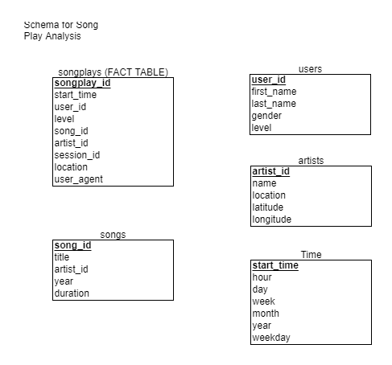

## DataModelingwPostgres
Includes files for building a Postgres Database based on queries
### Introduction

Sparkify is a music streaming app which needs a database designed so queries can be used to easily analyze song play data.

Using Postgres, we are designing the database so the data can easily be pulled from the tables.

The tables are designed around the queries.  The data is currently in json files.

#### Database Schema

*THE FACT TABLE*: The Fact Table is called 'songplays' and contains the columns songplay_id, start_time, user_id, level, song_id, artist_id, session_id, and location.  The songplay_id is the primary key for this table.  This means each row in this column is unique.  It is important that this column doesn't contain null values, so 'PRIMARY KEY NOT NULL' was used in the creation of this table.

*USERS TABLE*:  The "users" table is a table which contains the users of the app.  The "user_id" column is the primary key column, where the rows are all unique. The columns include user_id, first_name, last_name, gender, and level.  This table can be joined to the songplays table by using the 'user_id' column in each table.

*SONGS TABLE*: The "songs" table contains all the songs in the database.  The columns includes song_id, title, artist_id, year, and duration.  The "song_id" column is the primary key column for this table.  This table can be joined with songplays on 'song_id'.

*ARTISTS TABLE*: The "artists" table contains the artist names in the database.  The columns include artist_id, name, location, latitude and longitude.  The "artist_id" is the primary key for this table.  This table can be joined to the songplays table on artist_id, and also the songs table.

*TIME TABLE*: The "time" table has the timestamp data for the song plays broken down into smaller units of time.  The columns include start_time, hour, day, week, month, year, and weekday.  The start_time column is the primary key. The time table can be joined to the songplays table using start_time.

#### Files in repository

*The repository contains the following files*:

* data files in json format
* create_tables.py - the create_tables.py file runs the functions written in the sql_queries.py file which creates the tables
* etl.ipynb - the is a notebook where etl processes can be written before loading the datasets with etl.py
* etl.py - this file loads the datasets
* image.png - the schema diagram for the tables
* README.md - this file explains the project files and the purpose of the project
* sql_queries.py - this file contains the code to drop tables, create tables, and create queries.
* test.ipnyb

#### Visual Database Schema

'

